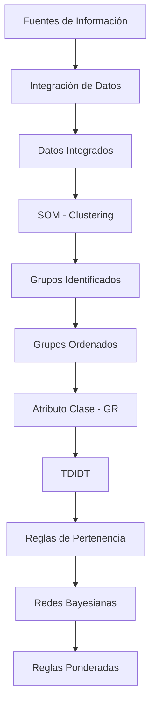
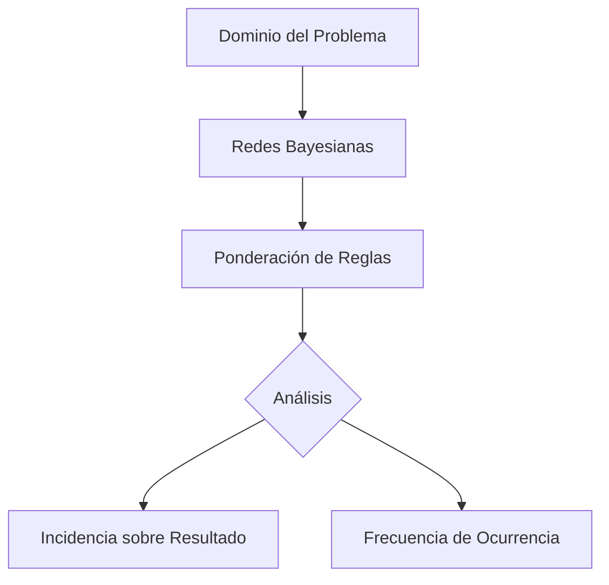

# descubrimiento-de-reglas

Implementación de un flujo completo de **Descubrimiento de Conocimiento (Knowledge Discovery)** utilizando técnicas de Inteligencia Artificial y Minería de Datos.

El proyecto integra **Mapas Autoorganizados (SOM)**, **Árboles de Decisión (TDIDT)** y **Redes Bayesianas** para descubrir, caracterizar y ponderar reglas de comportamiento a partir de datos, utilizando librerías especializadas de Python.

---

# Objetivos del Proyecto

Este repositorio tiene como objetivo:

- Utilizar Mapas Autoorganizados (SOM) mediante `minisom`.
- Utilizar Árboles de Decisión (TDIDT) mediante `scikit-learn`.
- Utilizar Redes Bayesianas mediante `pgmpy`.
- Descubrir grupos automáticamente.
- Generar reglas de pertenencia.
- Ponderar reglas mediante probabilidades.
- Analizar patrones de comportamiento.
- Aplicar técnicas de Minería de Datos e Inteligencia Artificial.

---

# Flujo General del Proyecto

El proceso completo consta de tres etapas principales.

## 1. Descubrimiento de Grupos

Los datos provenientes de distintas fuentes (bases de datos, archivos planos) son integrados en un único conjunto de información.

Posteriormente se aplica un **Mapa Autoorganizado (SOM)** para detectar automáticamente grupos con características similares.

---

## 2. Descubrimiento de Reglas

Una vez identificados los grupos, el atributo correspondiente al grupo se utiliza como clase objetivo.

Sobre estos datos se aplica un algoritmo **TDIDT** para generar reglas de clasificación que describen el comportamiento de cada grupo.

---

## 3. Ponderación de Reglas

Finalmente, las reglas obtenidas son analizadas mediante una **Red Bayesiana**, permitiendo determinar cuáles poseen mayor incidencia o probabilidad dentro del dominio del problema.

---

# Esquema General



---

# Flujo SOM + TDIDT: Reglas de Pertenencia

Este proceso describe la transformación de datos mediante aprendizaje no supervisado y supervisado.

1. **Fuentes de información**: Se identifican múltiples fuentes que incluyen bases de datos y archivos planos.
2. **Integración**: Estas fuentes se combinan en un único conjunto denominado "datos integrados".
3. **Procesamiento SOM**: Se aplican mapas auto-organizados sobre los datos integrados para particionar el conjunto de registros en diferentes grupos.
4. **Ordenamiento**: A partir de los grupos identificados, se generan archivos de "grupos ordenados".
5. **Clasificación (GR)**: El atributo de grupo de cada archivo se define como el "atributo clase", creando así un archivo con atributo clase identificado (GR).
6. **Inducción TDIDT**: Se aplica el algoritmo TDIDT sobre el atributo clase de cada grupo GR para extraer las reglas que definen el comportamiento de cada grupo.

---

# Flujo Redes Bayesianas: Ponderación de Reglas

Este proceso analiza la relevancia e influencia de distintas condiciones dentro del dominio del problema.

1. **Dominio del problema**: Se define el escenario de estudio.
2. **Aplicación de Redes Bayesianas**: Se utilizan para ponderar reglas ya existentes (de comportamiento o de pertenencia a grupos).
3. **Objetivo del proceso**: Identificar cuáles condiciones poseen mayor:
   - **Incidencia** en la obtención de un resultado específico.
   - **Frecuencia** de ocurrencia dentro del dominio analizado.



---

# Descubrimiento a partir de los Algoritmos

Al ejecutar el pipeline sobre el dataset `mall_customers.csv`, los algoritmos descubren automáticamente las siguientes estructuras:

## SOM: Grupos Naturales de Clientes

El SOM particiona los 200 clientes en **16 grupos** según sus patrones de comportamiento (Edad, Ingreso Anual, Puntaje de Gasto). El error de cuantización es de **18.851**, lo que indica que cada registro está cerca de su neurona representativa.

Los grupos se distribuyen en un mapa 4×4 donde:

- Las **zonas densas** del mapa representan perfiles de clientes muy comunes.
- Las **zonas vacías** indican combinaciones de atributos que no existen en los datos.
- La **U-Matrix** revela las fronteras naturales entre grupos — valores altos separan perfiles diferenciados.

Cada grupo captura un patrón distinto. Por ejemplo, algunos representan clientes jóvenes con bajo gasto, otros clientes de ingreso alto con gasto moderado, etc.

---

## TDIDT: Reglas de Pertenencia

El árbol de decisión genera **reglas legibles** que explican cómo se asigna cada cliente a su grupo. Las reglas usan solo las variables originales del dataset.

Ejemplo de reglas descubiertas:

```text
SI Spending_Score <= 60.50
  Y Annual_Income <= 45.00
    Y Age <= 41.00
      Y Spending_Score <= 19.50
        ENTONCES Grupo = 15

SI Spending_Score > 60.50
  Y Annual_Income > 54.00
    ENTONCES Grupo = 12
```

### Atributos más relevantes

El árbol revela que **Spending_Score** es el atributo más discriminante para separar los grupos, seguido de **Annual_Income** y **Age**. Esto indica que el comportamiento de gasto es la principal variable que distingue a los clientes.

### Lectura del árbol

Cada camino raíz-hoja representa una regla completa: una condición sobre los atributos que conduce a la asignación de un grupo específico. Las reglas más cortas indican condiciones claras y directas; las más largas describen perfiles más específicos.

---

## Red Bayesiana: Ponderación Probabilística

La red bayesiana modela las relaciones de dependencia entre las variables:

```text
Age ──────┐
          │
Income ───┼──→ Grupo
          │
Spending ─┘
```

Cada nodo padre (Age, Annual_Income, Spending_Score) tiene una influencia directa sobre el nodo hijo (Grupo). Las CPTs (Tablas de Probabilidad Condicional) cuantifican esa influencia.

### Probabilidad de cada grupo

La inferencia sin evidencia arroja las probabilidades marginales de pertenencia a cada grupo — todas similares (~6.2%), lo que indica un balance natural en la distribución de clientes.

### Inferencia con evidencia

La red permite preguntas como:

- ¿Cuál es la probabilidad de pertenecer al Grupo 12 si el cliente tiene Spending_Score alto e Income alto?
- ¿Qué grupo es más probable para un cliente joven con bajo Spending_Score?

Estas consultas determinan qué condiciones poseen **mayor incidencia** sobre la obtención de un resultado específico.

---

# Mapas Autoorganizados (SOM)

Los **Self Organizing Maps** permiten descubrir automáticamente grupos de registros similares sin utilizar información de clases.

Cada neurona representa un vector de pesos.

La neurona ganadora (BMU) se obtiene mediante:

$$
BMU=
\arg\min_i
||X-W_i||
$$

Los pesos se actualizan mediante:

$$
W_i(t+1)
=
W_i(t)
+
\alpha(t)
h_{ci}(t)
(X-W_i(t))
$$

El resultado del entrenamiento es una partición natural del conjunto de datos.

---

# Árboles de Decisión (TDIDT)

Una vez obtenidos los grupos, estos pasan a ser la clase objetivo.

El algoritmo selecciona el atributo que mejor separa los datos utilizando la Ganancia de Información.

La entropía se calcula como:

$$
H(S)
=
-
\sum_i
p_i
\log_2(p_i)
$$

La Ganancia de Información es:

$$
Gain(S,A)
=
H(S)
-
H(S,A)
$$

El árbol generado permite obtener reglas como:

```text
SI Edad = Joven
Y Ingreso = Alto

ENTONCES

Grupo = 3
```

---

# Redes Bayesianas

Las reglas obtenidas pueden ponderarse utilizando una Red Bayesiana.

La probabilidad conjunta se calcula mediante:

$$
P(X_1,X_2,\ldots,X_n)
=
\prod_i
P(X_i|Parents(X_i))
$$

La actualización de probabilidades se realiza utilizando el Teorema de Bayes:

$$
P(A|B)
=
\frac
{P(B|A)P(A)}
{P(B)}
$$

Esto permite conocer qué condiciones tienen mayor influencia sobre un determinado resultado.

---

# Aplicaciones

Este flujo puede utilizarse para:

- Segmentación de clientes.
- Descubrimiento de perfiles.
- Análisis de llamadas telefónicas.
- Predicción de ventas.
- Fidelización de clientes.
- Marketing.
- Sistemas expertos.
- Inteligencia de negocios.
- Soporte para la toma de decisiones.

---

# Casos de Uso

## Descubrimiento de Perfiles

El algoritmo SOM identifica grupos naturales de clientes.

Posteriormente TDIDT genera reglas que describen cada perfil.

Finalmente una Red Bayesiana identifica qué características poseen mayor influencia sobre cada grupo.

---

## Predicción de Ventas

Las Redes Bayesianas permiten determinar qué factores poseen mayor incidencia sobre el incremento de ventas.

---

## Clasificación de Llamadas

Los SOM descubren automáticamente tipos de llamadas.

TDIDT explica cada grupo mediante reglas.

Las Redes Bayesianas permiten ponderar la importancia de cada regla.

---

# Visualizaciones

El proyecto genera graficos automaticamente al ejecutar `python main.py`. Los archivos se guardan en la carpeta `plots/`.

## U-Matrix del SOM

```
plots/som_u_matrix.png
```

Mapa de calor que muestra las distancias promedio entre neuronas vecinas del SOM. **Valores altos** (tonos oscuros) indican fronteras entre clusters — zonas donde los datos son muy diferentes. **Valores bajos** (tonos claros) indican neuronas dentro del mismo cluster. Permite identificar visualmente cuantos grupos naturales existen en los datos.

## Distribucion de Hits por Neurona

```
plots/som_hits.png
```

Mapa de calor con la cantidad de registros que cayeron en cada neurona del SOM. **Neuronas con muchos hits** representan grupos densos de datos similares. **Neuronas vacias** indican zonas del espacio de atributos que no tienen registros representativos. Útil para evaluar si el tamano del mapa es adecuado.

## Scatter de Clusters

```
plots/clusters_scatter.png
```

Grafico de dispersion de los dos ultimos atributos, coloreado por grupo. Muestra la **separacion visual** de los clusters en el espacio de datos. Permite evaluar si los grupos son compactos y estan bien separados, o si hay solapamiento entre ellos.

## Distribucion por Grupo

```
plots/group_distribution.png
```

Grafico de barras con la cantidad de registros por grupo. Indica si los clusters estan **balanceados** (cantidades similares) o si hay grupos con muy pocos registros (posibles outliers) o grupos dominantes.

## Distribucion de Atributos

```
plots/feature_distributions.png
```

Histogramas con curva de densidad (KDE) de cada atributo. Muestra la **forma de los datos** antes del clustering: si hay distribuciones normales, sesgadas, o multimodales. Ayuda a entender por que el SOM agrupa de cierta manera.

## Importancia de Atributos (TDIDT)

```
plots/feature_importance.png
```

Grafico de barras horizontal con la importancia de cada atributo segun el arbol de decision. **Valores altos** indican que el atributo es mas determinante para separar los grupos. Permite identificar que variables son las mas relevantes para describir cada perfil.

## Grafo de la Red Bayesiana

```
plots/bayesian_network.png
```

Representacion visual de la estructura de la red bayesiana como grafo dirigido aciclico (DAG). Cada nodo es una variable y cada arco indica una **relacion de dependencia causal**. Permite ver rapidamente que variables influyen sobre la pertenencia a cada grupo.

---

# Estructura del Proyecto

```text
descubrimiento-de-reglas/
│
├── data/
│   └── mall_customers.csv
│
├── plots/
│   ├── som_u_matrix.png
│   ├── som_hits.png
│   ├── clusters_scatter.png
│   ├── group_distribution.png
│   ├── feature_distributions.png
│   ├── feature_importance.png
│   └── bayesian_network.png
│
├── src/
│   ├── __init__.py
│   ├── clustering.py
│   ├── rules.py
│   ├── bayesian.py
│   ├── utils.py
│   └── visualization.py
│
├── tests/
│   ├── __init__.py
│   ├── test_clustering.py
│   ├── test_rules.py
│   └── test_bayesian.py
│
├── main.py
├── requirements.txt
├── pytest.ini
├── .gitignore
└── README.md
```

---

# Ejecución

```bash
python main.py
```

Ejecuta el pipeline completo: SOM → TDIDT → Red Bayesiana. Los graficos se guardan automaticamente en `plots/`.

---

# Complejidad

## SOM

$$
O(N \cdot M \cdot D)
$$

donde:

- \(N\): cantidad de registros.
- \(M\): cantidad de neuronas.
- \(D\): cantidad de atributos.

---

## TDIDT

$$
O(n \cdot m \cdot v)
$$

donde:

- \(n\): cantidad de registros.
- \(m\): cantidad de atributos.
- \(v\): cantidad de valores posibles.

---

## Redes Bayesianas

La inferencia exacta posee una complejidad aproximada de:

$$
O(2^n)
$$

---

# Tecnologías Utilizadas

## Librerías

- `minisom` — Implementación de Self Organizing Maps (SOM)
- `scikit-learn` — Árboles de Decisión (TDIDT) y preprocesamiento
- `pgmpy` — Redes Bayesianas y inferencia probabilística
- `pandas` — Manipulación y análisis de datos
- `numpy` — Operaciones numéricas
- `seaborn` — Visualización estadística
- `matplotlib` — Gráficos y plots
- `networkx` — Grafos y redes

## Conceptos

- Clustering (SOM)
- Clasificación (TDIDT)
- Redes Bayesianas
- Probabilidad Condicional
- Teorema de Bayes
- Descubrimiento de Reglas
- Inteligencia Artificial
- Minería de Datos

---

# Testing

```bash
pytest
```

---

# Referencias

- Teuvo Kohonen. *Self-Organizing Maps.*
- Ross Quinlan. *Induction of Decision Trees.*
- Judea Pearl. *Probabilistic Reasoning in Intelligent Systems.*
- Han, Kamber & Pei. *Data Mining: Concepts and Techniques.*
- Russell & Norvig. *Artificial Intelligence: A Modern Approach.*